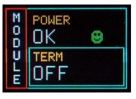

# N1470 remote control manual

### 1. Remote communication control section

- Fig.1 The remote control section

This section include three parts: IN , OUT and USB connectors. The module permits **RS485** and **RS232** port. In this page, **RS232** is used only. 

As is shown in Fig.1, three-pin cable for **RS232** connector is needed, where **RX** represents "Receive(rx) Data", **TX** for "Transmit(tx) Data" and **GND** for "ground". 

### 2. Connection

- Fig.2 RS232 communication

**IN** and **OUT** should be connected using the three-pin Dupont-Connector cables one by one where **TX RX** and **GND** must be connected. The last module need **turn on** the ***Termination*** as well as all modules need to **turn on** the ***Adaptation***.
 ### 3. Jumpers and switchs
 
 
 
 - Fig.3 Internal switch
 
In the Fig.3, the yellow boxs represent the ***Adaptation*** switches, and they must be pushed to the ***right hand*** for **RS232** communication and ***left hand*** for **RS485** communication. 
The red boxs represent the ***Termination*** switches, and they must be turn on for the last module for daisy chain purpose. This switch state can be checked in the module setting screen as is shown in Fig.4.

 
 
 **For more details, please check the [N1470 user manual](./manual/N1470.pdf)**
 ### 4. Settings on PC
 
 waiting for update...
 
